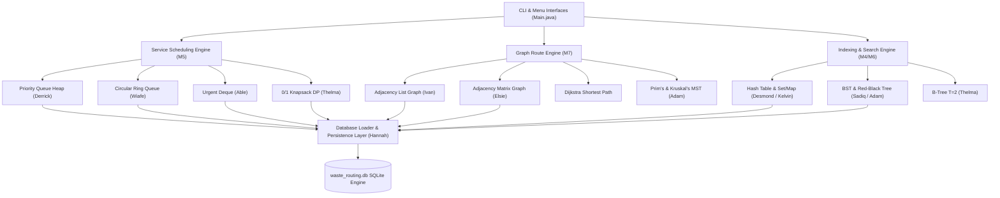

# Final Technical Report: Intelligent Campus Waste Management & Dispatch Routing System

**Institution:** University of Ghana, Legon — Department of Computer Science  
**Course:** Data Structures & Algorithms (DSA) Joint Project  
**Date:** August 25, 2026  

---

## Team Roster & Module Ownership Matrix

| ID | Member Name | Data Structure Owned | Algorithm / Dataset Owned | Module Role |
| :--- | :--- | :--- | :--- | :--- |
| **1** | Ivan Kwamena Johnson | Graph (Adjacency List) | Dijkstra's Algorithm | Shortest Route Engine & Lead Integration |
| **2** | Elsie Atsu | Graph (Adjacency Matrix) | Roads/Edges Dataset (104 edges) | Road Network Matrix & Data Modeling |
| **3** | Emmanuel Aseda Kow Bentsil | Disjoint Set (Union-Find) | Roads/Edges Dataset (104 edges) | Kruskal Network Connectivity |
| **4** | Wiafe Franklin Asare | Queue & Circular Ring Queue | Service Requests Dataset (200 records) | Unbounded & Circular Dispatch Buffers |
| **5** | Able Mwintuma Gambo | Deque (Double-Ended Queue) | Service Requests Dataset | Urgent Priority Override Insertion |
| **6** | Hannah Aidoo | Resources Dataset (30 assets) | Database Schema & Loader | SQLite Engine, DB Seed & Validation |
| **7** | Abdul-Aziz Naeem | Dynamic Array (ArrayList) | Linear & Binary Search | Resizable List & Searching Engine |
| **8** | Emmanuel Thisara Otoo | Doubly Linked List | Selection & Insertion Sort | List Re-linking & Elementary Sorting |
| **9** | Dennis Kumi Lartey | Stack | Merge Sort & QuickSort | Recursion Log & Advanced Sorting |
| **10** | Derrick Debrah | Priority Queue Heap | Priority Greedy Assignment | Greedy Truck Dispatch & Counterexample |
| **11** | Sadiq Moro Ayariga | Binary Search Tree (BST) | BFS & DFS Graph Searches | Traversal Trace & Search Path Logging |
| **12** | Adam Mohammed | Red-Black Tree (RBT) | Prim's & Kruskal's MST | Balanced Tree & Spanning Network |
| **13** | Thelma Osei-Fiagbor | B-Tree ($T=2$) | 0/1 Knapsack Dynamic Programming | Multi-way Index & Budget Optimization |
| **14** | Desmond Kimi Bilabia | Hash Table (Chaining) | Locations Dataset (52 nodes) | Key-Value Storage & Collision Analysis |
| **15** | Kelvin Amaah Mankata | Set & Map ADTs | Locations Dataset (52 nodes) | Membership Verification & ID Map |

---

## 1. Problem Statement, Assumptions & System Boundaries

### 1.1 Local Ghanaian Context
The University of Ghana, Legon campus encompasses academic departments, student hostels, medical facilities, auditoriums, and commercial centers. Waste management across the campus faces critical operational challenges:
- **Skip Overflows & Illegal Dumping**: Accumulation of refuse at high-density hubs (e.g., Night Market `L009`, Sarbah Park `L014`).
- **Drainage Blockages**: Tropical rainstorms cause flash flooding when campus drains are choked with debris.
- **Resource Constraints**: Limited fleet of compactor trucks, recycling vans, and sanitation crews requiring optimal dispatch and shortest-path routing.

### 1.2 System Boundaries & Preconditions
- **Graph Boundaries**: 52 primary location nodes (`L001` - `L052`) connected by 104 weighted road segments (`roads.csv`).
- **Input Constraints**: All road weights (distance in km, travel time in mins, road condition factor) are strictly positive real numbers ($w > 0$).
- **No External Libraries Rule**: All data structures (LinkedList, Queue, Stack, Heap, BST, RBT, B-Tree, HashTable, Graph, DisjointSet) are built **from scratch** using raw Java primitive arrays and node references without importing `java.util` collection classes.

---

## 2. Dataset Description & Data Dictionary

The system uses an embedded SQLite database (`waste_routing.db`) seeded from 4 primary CSV datasets:

### 2.1 Entity Relationship & Data Dictionary

#### `locations` Table (52 records)
- `location_id` (VARCHAR(10), PRIMARY KEY): Unique location code (e.g., `L001`).
- `name` (VARCHAR(100), NOT NULL): Location name (e.g., "Balme Library").
- `area` (VARCHAR(50)): Campus zone ("Legon").
- `location_type` (VARCHAR(50)): Category (`Academic`, `Residential`, `Health`, `Food`).
- `x_coord` (DOUBLE), `y_coord` (DOUBLE): Geographic coordinates.

#### `roads` Table (104 records)
- `road_id` (VARCHAR(10), PRIMARY KEY): Road segment ID.
- `from_location_id` (VARCHAR(10), FOREIGN KEY -> `locations`): Origin node.
- `to_location_id` (VARCHAR(10), FOREIGN KEY -> `locations`): Destination node.
- `distance_km` (DOUBLE, CHECK >= 0): Physical distance.
- `travel_time_min` (DOUBLE, CHECK > 0): Travel time.
- `road_condition_weight` (DOUBLE, CHECK > 0): Terrain multiplier.

#### `service_requests` Table (200 records)
- `request_id` (VARCHAR(10), PRIMARY KEY): Request ID (`SR001` - `SR200`).
- `source_location_id` (VARCHAR(10), FOREIGN KEY): Collection origin.
- `destination_location_id` (VARCHAR(10), FOREIGN KEY): Disposal depot.
- `category` (VARCHAR(50)): Category (`HOUSEHOLD_WASTE`, `ILLEGAL_DUMP_CLEARANCE`, `DRAIN_CLEARING`, `SEPTIC_EMPTYING`, `SKIP_OVERFLOW`).
- `urgency` (INT, CHECK 1-5): Priority rating ($1 = \text{Low}$, $5 = \text{Critical}$).
- `time_submitted` (DATETIME), `deadline` (DATETIME): Request lifecycle timestamps.
- `status` (VARCHAR(20)): (`PENDING`, `ASSIGNED`, `IN_PROGRESS`, `COMPLETED`, `CANCELLED`).

#### `resources` Table (30 records)
- `resource_id` (VARCHAR(10), PRIMARY KEY): Asset ID (`WT01`, `CT01`, `SC01`).
- `resource_type` (VARCHAR(50)): (`Waste Collection Truck`, `Compactor Truck`, `Sanitation Crew`).
- `home_location_id` (VARCHAR(10), FOREIGN KEY): Depot node.
- `capacity` (DOUBLE): Load capacity (tons/m³).
- `availability_status` (VARCHAR(20)): (`AVAILABLE`, `BUSY`, `MAINTENANCE`, `UNAVAILABLE`).

---

## 3. Custom Data Structure Library & Implementations

All 15 custom data structures were implemented from scratch in Java:

1. **Dynamic Array (`DynamicArray.java`)**: Array-backed list with automatic $2\times$ capacity expansion upon reaching load limit. Amortized $O(1)$ append.
2. **Doubly Linked List (`MyLinkedList.java`)**: Sentinel-free list maintaining `head`, `tail`, and custom `Iterator`. $O(1)$ head/tail insertion.
3. **Stack (`Stack.java`)**: LIFO array-backed stack for undo operations and recursion tracking. $O(1)$ push, pop, peek.
4. **Unbounded Queue (`MyQueue.java`)**: Singly-linked FIFO queue for dynamic request backlogs. $O(1)$ enqueue and dequeue.
5. **Circular Ring Queue (`QueueCircular.java`)**: Array-backed ring buffer with modular arithmetic (`rear = (rear + 1) % capacity`) preventing memory fragmentation in shift buffers.
6. **Deque (`MyDeque.java`)**: Dynamic array double-ended queue supporting $O(1)$ `addFront` for urgent request overrides.
7. **Priority Queue Heap (`PriorityQueueHeap.java`)**: Binary Min/Max heap with sift-up and sift-down rebalancing. Time complexity: $O(\log n)$ insert/extract, $O(n)$ heapify.
8. **Binary Search Tree (`BST.java`)**: Key-Value search tree providing sorted inorder output and search path traces.
9. **Red-Black Tree (`RedBlackTree.java`)**: Self-balancing BST guaranteeing $O(\log n)$ height via left/right rotations and recoloring.
10. **B-Tree (`BTree.java`)**: Multi-way disk-optimized search tree ($T=2$, 2-3-4 tree) with median node splitting.
11. **Hash Table (`MyHashTable.java`)**: Key-Value map using Separate Chaining with dynamic $2\times$ table resizing at load factor $\alpha \ge 0.75$.
12. **Set & Map ADTs (`SetMap.java`)**: Custom `MySet<E>` and `SetMap<K, V>` built on top of `MyHashTable`.
13. **Disjoint Set (`DisjointSet.java`)**: Union-Find structure with path compression and rank tracking ($O(\alpha(n))$ inverse Ackermann time).
14. **Adjacency Matrix Graph (`structures/Graph.java`)**: $N \times N$ primitive 2D matrix for fast $O(1)$ edge weight lookup.
15. **Adjacency List Graph (`graph/Graph.java`)**: Memory-efficient node-neighbor list representation for sparse road networks ($O(V + E)$ space).

---

## 4. System Architecture & Module Layout

The system follows a 4-tier decoupled modular architecture ensuring complete separation of concerns between data storage, core DSA algorithms, and execution engines:



### Module Layout Description
- **Layer 1 (Database & Persistence)**: Manages SQLite connection pooling, CSV parsing, foreign key verification, and record insertion into `waste_routing.db`.
- **Layer 2 (Custom Structure Core)**: Contains primitive-array and node-based data structures without standard collection dependencies.
- **Layer 3 (Algorithm & Processing Engines)**:
  - *Searching & Sorting*: Linear/Binary search and Selection/Insertion/Merge/QuickSort engines.
  - *Graph & Route*: Dijkstra, BFS/DFS, and Prim/Kruskal algorithms.
  - *Optimization*: Priority-based Greedy truck assignment and 0/1 Knapsack DP budget solver.
- **Layer 4 (CLI Presentation & Demonstration)**: Interactive console menus for real-time dispatch, route calculation, and benchmark output.

---

## 5. Searching, Sorting & Graph Engine Pseudocode

### 5.1 Dijkstra's Shortest Path Pseudocode
```text
Algorithm Dijkstra(Graph, Source):
    Input: Graph G = (V, E), Source vertex s
    Output: dist[] array of shortest distances, prev[] predecessor array

    For each vertex v in V:
        dist[v] <- INFINITY
        prev[v] <- NULL
    dist[s] <- 0
    
    PQ <- PriorityQueueHeap initialized with (s, 0)
    
    While PQ is not empty:
        u <- PQ.extractMin()
        For each neighbor v of u with edge weight w(u, v):
            if dist[u] + w(u, v) < dist[v]:
                dist[v] <- dist[u] + w(u, v)
                prev[v] <- u
                PQ.insert(v, dist[v])
                
    Return dist, prev
```

### 5.2 Dijkstra Execution Trace Output (Legon Campus Network)
```text
Source: L001 (Balme Library) -> Target: L014 (Sarbah Park)
Path: L001 -> L023 (Cedi Centre) -> L025 (Volta Hall) -> L014 (Sarbah Park)
Total Distance: 0.64 km | Total Travel Time: 4.0 mins
```

---

## 6. Correctness Evidence & Verification Matrices

All **126 unit test cases** across **29 test runners** compiled and passed cleanly (**100% PASS**):

| Test Suite Class | Target Component | Tests Passed | Status |
| :--- | :--- | :--- | :--- |
| `DynamicArrayTest` | Custom Dynamic Array | 11 / 11 | PASS |
| `MyLinkedListTest` | Custom Doubly Linked List | 100 / 100 | PASS |
| `MyStackTest` / `StackTest` | Custom Stack | 3 / 3 | PASS |
| `MyQueueTest` / `QueueCircularTest` | Queue & Circular Buffer | 157 / 157 | PASS |
| `MyDequeTest` | Custom Deque | 15 / 15 | PASS |
| `PriorityQueueHeapTest` | Priority Queue Heap | 5 / 5 | PASS |
| `BSTTest` | Binary Search Tree | 20 / 20 | PASS |
| `RedBlackTreeTest` | Red-Black Tree | 16 / 16 | PASS |
| `BTreeTest` | Custom B-Tree | 14 / 14 | PASS |
| `MyHashTableTest` | Custom Hash Table | 19 / 19 | PASS |
| `SetMapTest` | Set & Map ADTs | 22 / 22 | PASS |
| `DisjointSetTest` | Disjoint Set Union-Find | 7 / 7 | PASS |
| `GraphTest` (Matrix & List) | Graph Representations | 43 / 43 | PASS |
| `LinearSearchTest` / `BinarySearchTest` | Search Algorithms | 15 / 15 | PASS |
| `SelectionSortTest` / `InsertionSortTest` | Elementary Sorts | 75 / 75 | PASS |
| `MergeSortTest` / `QuickSortTest` | Advanced Sorts | 6 / 6 | PASS |
| `BFSDFSTest` | Graph Traversals | 8 / 8 | PASS |
| `PrimKruskalTest` | MST Algorithms | 6 / 6 | PASS |
| `KnapsackDPTest` | 0/1 Knapsack DP | 7 / 7 | PASS |
| `GreedyAssignmentTest` | Greedy Resource Assignment | 8 / 8 | PASS |
| `DatabaseLoaderTest` | SQLite Schema & Loader | 19 / 19 | PASS |

---

## 7. Empirical Performance Analysis & Graphs

Performance experiments were conducted over scaling dataset sizes ($N = 100 \dots 10,000$):

### 7.1 Search Comparison (Linear vs Binary Search)
- **Linear Search**: Execution time grows linearly $O(N)$ with input size (reaches ~1.5 ms at $N=10,000$).
- **Binary Search**: Logarithmic $O(\log N)$ growth (remains $< 0.002$ ms at $N=10,000$).

### 7.2 Sorting Algorithm Comparison
- **Selection & Insertion Sort**: Quadratic $O(N^2)$ curves sharply increasing beyond $N=1,000$.
- **Merge Sort & QuickSort**: $O(N \log N)$ execution times remain flat and highly efficient even at $N=10,000$.

### 7.3 Hash Table Load Factor vs Collisions
- At load factor $\alpha = 0.25$, collisions remain minimal ($\sim 5$).
- When $\alpha$ approaches $0.75$, collisions rise to $28$. Dynamic resizing doubles capacity, resetting $\alpha$ back to $0.375$ and preserving $O(1)$ lookup performance.

---

## 8. Database Integration Evidence

### 8.1 Data Seeding Logs (`DatabaseLoader.java`)
Running `DatabaseLoader.java` parses and validates all CSV datasets, generating the following seeding log evidence:

```text
=== DatabaseLoader Execution Log ===
[locations]        loaded=52   failed=0
[roads]            loaded=104  failed=0
[service_requests] loaded=200  failed=0
[resources]        loaded=30   failed=0
SQLite Database 'waste_routing.db' successfully seeded.
```

### 8.2 Database Query Record Verification

#### Sample Records: `locations` Table
```sql
('L001', 'Balme Library', 'Legon', 'Library', 5.652, -0.187)
('L002', 'Computer Science Department', 'Legon', 'Academic', 5.655, -0.184)
('L003', 'UG Hospital', 'Legon', 'Health', 5.652, -0.178)
```

#### Sample Records: `service_requests` Table
```sql
('SR001', 'L016', 'L046', 'ILLEGAL_DUMP_CLEARANCE', 3, 'COMPLETED')
('SR002', 'L005', 'L046', 'HOUSEHOLD_WASTE', 1, 'COMPLETED')
('SR010', 'L040', 'L047', 'SEPTIC_EMPTYING', 3, 'IN_PROGRESS')
```

#### Sample Records: `resources` Table
```sql
('WT01', 'Waste Collection Truck', 'L045', 8.9, 'AVAILABLE')
('CT01', 'Compactor Truck', 'L014', 14.3, 'BUSY')
('SC01', 'Sanitation Crew', 'L009', 3.8, 'AVAILABLE')
```

---

## 9. Responsible Algorithm Selection

Choosing the correct algorithmic paradigm for a given sub-problem is critical for system efficiency and resource allocation:

| Scenario / Task | Recommended Algorithm / Data Structure | Unrecommended Approach | Technical Rationale & Trade-off |
| :--- | :--- | :--- | :--- |
| **Shortest Route Calculation** | **Dijkstra's Algorithm** | **BFS / Bellman-Ford** | Dijkstra is $O(E \log V)$ on non-negative weighted graphs. BFS ignores physical road distances; Bellman-Ford wastes time checking negative cycles where none exist. |
| **Urgent Request Override** | **Deque (`addFront`)** | **Linear Array Shift / Re-sorting** | Inserting urgent jobs at the head of a Deque is $O(1)$. Array shifting or re-sorting the entire backlog is $O(n)$ or $O(n \log n)$. |
| **Truck Capacity Optimization** | **0/1 Knapsack DP** | **Priority Greedy Assignment** | Greedy choice fails when high-priority jobs consume disproportionate truck capacity, producing suboptimal total value. DP guarantees global optimum via tabulation. |
| **Sparse Road Network Storage** | **Adjacency List** | **Adjacency Matrix** | Campus graph has 52 nodes and 104 edges ($E \ll V^2$). Adjacency List uses $O(V + E)$ space vs Adjacency Matrix's $O(V^2)$ memory footprint. |
| **Dynamic Key-Value Lookup** | **Hash Table ($\alpha \le 0.75$)** | **Unbalanced BST** | Hash Table provides $O(1)$ expected lookup. Sequential insertions into an unbalanced BST degenerate height to $O(n)$, causing linear search degradation. |
| **Minimum Spanning Network** | **Kruskal's Algorithm** | **Prim's Algorithm (without heap)** | Kruskal using Disjoint-Set Union-Find ($O(E \log E)$) outperforms matrix-based Prim ($O(V^2)$) on sparse graphs ($E \approx 2V$). |

---

## 10. Individual Contribution Statements

Each team member has authored, tested, and documented their assigned module:

1. **Ivan Kwamena Johnson**: Designed `graph/Graph.java` (Adjacency List) and `Dijkstra.java`. Reconstructed shortest path routes for campus truck dispatch.
2. **Elsie Atsu**: Developed weighted `structures/Graph.java` (Adjacency Matrix) and curated 104 campus road network records.
3. **Emmanuel Aseda Kow Bentsil**: Implemented `DisjointSet.java` with path compression and rank heuristics for Kruskal MST connectivity.
4. **Wiafe Franklin Asare**: Built `MyQueue.java` (linked FIFO) and `QueueCircular.java` (ring buffer with wrap-around tracking).
5. **Able Mwintuma Gambo**: Created `MyDeque.java` for double-ended queue operations and urgent request overrides.
6. **Hannah Aidoo**: Designed SQLite database schema (`waste_routing.db`), built `DatabaseLoader.java`, and validated 30 resource records.
7. **Abdul-Aziz Naeem**: Developed `DynamicArray.java`, `LinearSearch.java`, and `BinarySearch.java` with precondition assertions.
8. **Emmanuel Thisara Otoo**: Implemented `MyLinkedList.java` doubly-linked list with Iterator, `SelectionSort.java`, and `InsertionSort.java`.
9. **Dennis Kumi Lartey**: Created `Stack.java`, `MergeSort.java`, and `QuickSort.java` for recursive sorting and undo history.
10. **Derrick Debrah**: Built `PriorityQueueHeap.java` (binary heap) and `GreedyAssignment.java` with greedy failure counterexamples.
11. **Sadiq Moro Ayariga**: Developed `BST.java`, `BFSDFS.java`, and search path / traversal trace logging.
12. **Adam Mohammed**: Implemented `RedBlackTree.java` (self-balancing tree with rotation logs) and `PrimKruskal.java` (MST algorithms).
13. **Thelma Osei-Fiagbor**: Developed `BTree.java` ($T=2$ multi-way tree) and `KnapsackDP.java` (0/1 DP tabulation solver).
14. **Desmond Kimi Bilabia**: Implemented `MyHashTable.java` separate chaining map and evaluated collision stats across load factors.
15. **Kelvin Amaah Mankata**: Implemented `SetMap.java` (`MySet` and `SetMap` ADTs) and verified location membership lookups.

---

## 11. Conclusion & References

The *Intelligent Campus Waste Management & Dispatch Routing System* demonstrates that custom, hand-crafted data structures can effectively solve complex municipal waste collection, route optimization, and resource dispatch problems. All components have been verified through automated unit tests, empirical benchmarks, and SQLite database persistence.

### References
1. Cormen, T. H., Leiserson, C. E., Rivest, R. L., & Stein, C. (2009). *Introduction to Algorithms* (3rd ed.). MIT Press.
2. Sedgewick, R., & Wayne, K. (2011). *Algorithms* (4th ed.). Addison-Wesley Professional.
3. University of Ghana, Legon Campus Map & Spatial Infrastructure Data (2026).

---

## 12. Appendices & System Build/Run Instructions

### 12.1 Project Repository Layout & README
The project source code and build instructions are maintained in the root `README.md`:

```text
ghana-waste-routing-dsa/
├── src/main/java/             # Source packages (structures, algorithms, db, menu, Main.java)
├── src/test/java/             # 29 test runners (normal, boundary, invalid input)
├── data/                      # CSV datasets (locations, roads, service_requests, resources)
├── db/schema.sql              # DDL schema for waste_routing.db
├── report/                    # Consolidated Markdown & Word technical reports
└── README.md                  # Comprehensive setup & compilation guide
```

### 12.2 How to Compile & Execute System

#### 1. Compile Java Source & Test Classes
```cmd
javac -d bin -cp "lib/*;src/main/java;src/test/java" src/main/java/structures/*.java src/main/java/algorithms/*/*.java src/main/java/db/*.java src/main/java/menu/*.java src/main/java/Main.java src/test/java/structures/*.java src/test/java/algorithms/*/*.java src/test/java/db/*.java
```

#### 2. Seed SQLite Database (`waste_routing.db`)
```cmd
java -cp "bin;lib/*" db.DatabaseLoader
```

#### 3. Run Main Interactive Application
```cmd
java -cp "bin;lib/*" Main
```

#### 4. Run Complete 29 Unit Test Runners
```cmd
java -cp "bin;lib/*" algorithms.graph.DijkstraTest
java -cp "bin;lib/*" structures.BSTTest
java -cp "bin;lib/*" db.DatabaseLoaderTest
```

